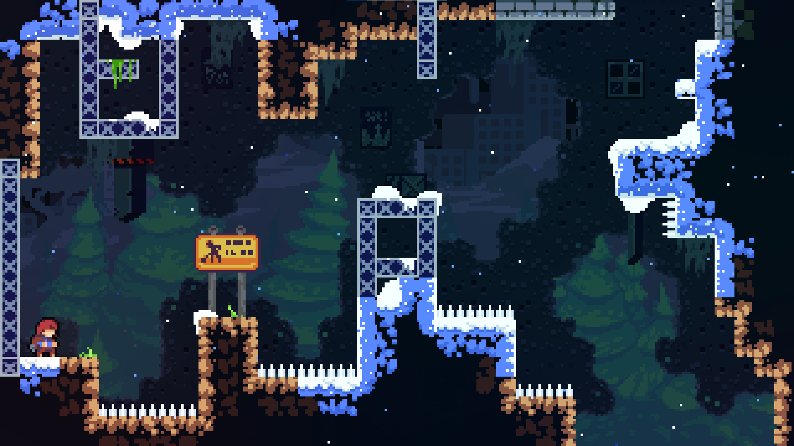

# Creating an AI Bot to Play Celeste

Celeste is a fantastic game that I've spent hours playing. Last year, I discovered Reinforcement Learning (RL) for work-related purposes, and the idea of creating an AI capable of playing Celeste using RL came to my mind in early February 2023.

Here is a good attemp of the AI on the five first screens : 
(It is obviously quicker than the vanilla game because I emulate it)

 

## Why Celeste is Interesting for an RL Problem

### Celeste has really simple controls. 

Madeline, the protagonist of the game, has only four actions:

1. Move in eight directions (left, right, up, down, and diagonals)
2. Jump
3. Grab a wall
4. Dash

There is no need for an inventory, nor any use of the mouse, or other actions requiring complicated mechanisms. This advantage should allow an RL algorithm to easily learn the actions.

### The format of the game is very suitable for a Reinforcement Learning problem. 

For those who have never played Celeste, the game is divided into seven levels (for the main game), but each level is also divided into several screens. In each screen, Madeline has a respawn point. The goal is to traverse from the start of the screen to the end without dying. If you die, no problem; you just respawn where you were without any penalties. This creates an excellent episodic and static environment. You can die hundreds of times without a game over; only your death counter will increase.

Because there are several screens, all of them static, you can create a changing but also static environment, which is really interesting for RL algorithms.

### Celeste is Emulatable

A crucial part of a Reinforcement Learning problem is how quickly the environment will execute and how you can interact with it. Thanks to the Celeste Community, this is all possible. I'm not a proficient game developer, and Celeste is a C# game, while all RL algorithms use Python libraries. Interaction between Python and C# would have been too hard for me to implement.

Fortunately, Celeste has a great community that creates mods, especially one, CelesteTAS. A TAS (Tool-Assisted Speedrun) bot plays Celeste by executing all the commands at each action, allowing players to test the limits of the game. This mod works with a text editor that sends requests to the mod and allows several things:

1. Send actions to the game
2. Load any screen you want in a level
3. Accelerate or Pause the game
4. Get current information like the position, speed, etc., of Madeline

Thanks to CelesteTAS, I've been able to create an easy interaction with the game, making it about three times faster than the normal game with more precision. I can also choose the spawn point for Madeline, which helps a lot in training because you can spawn Madeline close or far from the goal to help her discover it. Even in the first level, it's nearly impossible to randomly finish the level with the classic start point.

## Formalization of the Reinforcement Learning Problem

An episode starts with Madeline, and for now, it ends either if Madeline dies, changes screens, or after a certain number of steps. In the future, I plan to remove the episode end when Madeline changes screens.

To create a Reinforcement Learning problem, you need to identify several components:

### The Actor: 

Obviously, the Actor is Madeline.

### The Actions: 

An important point here is that Celeste is a 60 fps game, meaning you can literally take 60 actions per step, which is A LOT! I decided to simplify this by allowing five frames per action, which makes the learning easier and simplifies other things (some actions don't really apply if you do them for just one frame).

I've previously listed the different actions in the game; they're quite similar for the RL problem but with two distinctions:

- Madeline doesn't have one action to move in eight directions, but two actions to move in two directions: one to go right and left, and one to go up and down.
- If Madeline jumps for only one frame, it's a small jump, so I decided to divide the jump action into three: no jump, jump one frame, jump five frames.

This leads to a multi-action space [3, 3, 2, 3, 2]:

- Action for moving horizontally: 0 for left, 1 for nothing, 2 for right.
- Action for moving vertically: 0 for down, 1 for nothing, 2 for up.
- Action for Dashing: 0 for nothing, 1 for dashing.
- Action for Jumping: 0 for no jump, 1 for small jump, 2 for big jump.
- Action for Grab/Climb: 0 for no grab, 1 for grab.

### The Observation Space:

#### First case: Information only

With all the data provided by the CelesteTAS mod, an observation is possible. The standard observation size is eleven with values between 0 and 1, or -1 and 1, and includes position, speed, stamina, state, ability to dash or jump, etc. This can be supplemented with additional information like the coordinates of the screen's goal or the index of the screen, as well as historical information with the states of previous steps.

#### Second case: The Game Image

There's the possibility to provide Madeline with the entire screen image, reduced in size. It should allow the agent to really understand a screen and learn how to finish a screen it hasn't been trained on before. You can also provide a history of images.

### The Reward:

I have tested various possibilities for the reward, and one approach has given great results:

- Reward = 100 if goal is reached
- Reward = -1 if Madeline dies
- Reward = 0 if Madeline reaches an unwanted screen
- Reward = -1 * (distance_from_goal)^2 in other cases (normalized to the interval [-1, 0])

## Implemented Algorithms:

For this project, I've had the opportunity to implement and test several algorithms, including Deep Q-Learning, A2C, PPO, and SAC. Each of these algorithms has had its strengths and weaknesses in dealing with the environment and learning the game effectively. Currently, SAC is yielding the best results.

Deep Q-Learning : [Paper](https://arxiv.org/abs/1509.06461)

A2C : [Paper](https://arxiv.org/abs/1602.01783)

PPO : [Paper](https://arxiv.org/abs/1707.06347)

SAC : [Paper](https://arxiv.org/abs/1801.01290)

## Results:

Coming soon :)

I have only uploaded the video at the top for know.

I have some promising results on the first two screens of the game right now with SAC, without using the image. The challenge is that even after 36 hours of training, SAC is unable to learn from the image. I'm not yet sure why and how to correct this.

## Future Plans:

- Add Adjusted Temperature to SAC
- Add LSTM or RNN layers to SAC and other future algorithms
- Create a recording method to showcase results
- Update PPO with extensions to avoid getting stuck in suboptimal solutions
- Update A2C and Deep Q-Learning to make them runnable.
